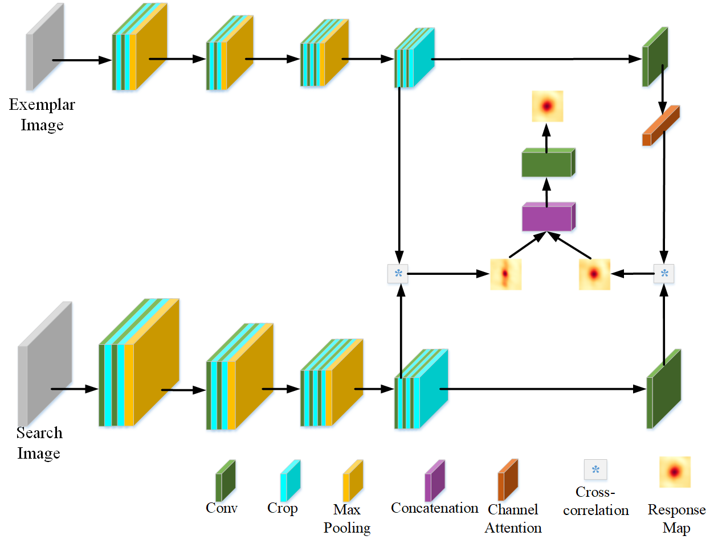
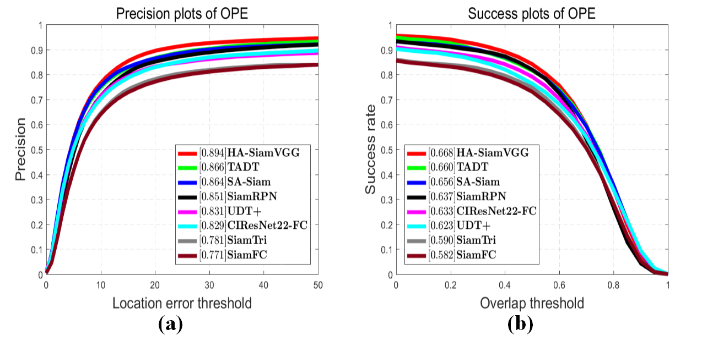

# Deeper Siamese Network with Stronger Feature Representation for Visual Tracking

- #### Overall network architecture of the proposed HA-SiamVGG tracker



- #### **Results on OTB2015**

  

#### Test the tracker

- If you want to test the tracker on the single image sequence, please provide the correct path for the test sequence and the default model is in  `pretrained/model.pth`.  Then, run

  ```python
  python one_seq_test.py
  ```

- If you want to test some models after training on the full OTB2015 dataset, please provide the correct path for dataset and location which saving the models. Then, run

  ```  python
  python model_test_mine.py
  ```

####  Training

- Please provide the correct path for the GOT10K dataset and run

  ```python
  python train.py
  ```

  The default location saving the models after training is `./pretrained`

### Publication

Zhang C, Wang H, Wen J, *et al*. Deeper Siamese Network With Stronger Feature Representation for Visual Tracking[J]. *IEEE Access*, 2020, 8: 119094-119104.

https://ieeexplore.ieee.org/document/9127416?source=authoralert